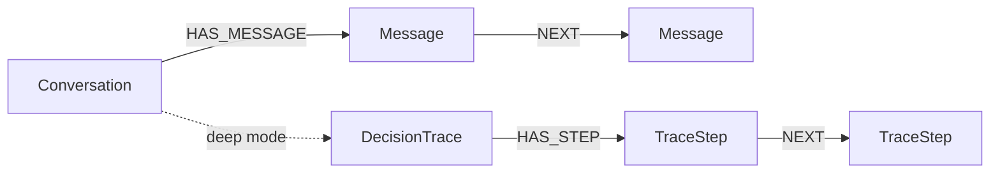

# Chat Import Schema

Reference for the graph schema produced by the Claude AI and ChatGPT chat history import connectors.



## Entity Types

### Conversation

One node per imported conversation.

| Property | Type | Description |
|----------|------|-------------|
| `name` | string | Conversation title (from export) or `conv-{uuid}` fallback |
| `conversation_id` | string | Original platform UUID |
| `source` | string | `"claude-ai"` or `"chatgpt"` |
| `created_at` | string | ISO 8601 timestamp of conversation creation |
| `updated_at` | string | ISO 8601 timestamp of last update |
| `message_count` | integer | Number of messages in the conversation |
| `model_slug` | string | Default model used (ChatGPT only, e.g. `"gpt-4o"`) |

### Message

One node per message within a conversation.

| Property | Type | Description |
|----------|------|-------------|
| `name` | string | `msg-{uuid[:12]}` identifier |
| `role` | string | `"user"`, `"assistant"`, or `"tool"` |
| `content` | string | Message text (truncated to 2,000 characters) |
| `created_at` | string | ISO 8601 timestamp |
| `conversation_id` | string | Parent conversation UUID |
| `has_tool_calls` | boolean | Whether this message contains tool use blocks (Claude AI) |
| `has_tool_results` | boolean | Whether this message contains tool results (ChatGPT) |
| `model_slug` | string | Model used for this specific message (ChatGPT only) |

### Document

One document per conversation, containing the full concatenated text for search and RAG.

| Property | Type | Description |
|----------|------|-------------|
| `title` | string | `"Claude AI: {title}"` or `"ChatGPT: {title}"` |
| `content` | string | Full conversation text with role labels |
| `template_id` | string | Always `"chat-import"` |
| `template_name` | string | `"Claude AI Conversation"` or `"ChatGPT Conversation"` |
| `conversation_id` | string | Source conversation UUID |
| `source` | string | `"claude-ai"` or `"chatgpt"` |
| `created_at` | string | ISO 8601 timestamp |

### DecisionTrace (deep mode only)

Tool call sequences captured as reasoning traces.

| Property | Type | Description |
|----------|------|-------------|
| `id` | string | `"claude-ai-trace-{uuid}"` or `"chatgpt-trace-{uuid}"` |
| `task` | string | `"Tool usage in: {conversation title}"` |
| `outcome` | string | Summary of tool call count |

### TraceStep (deep mode only)

Individual steps within a decision trace.

| Property | Type | Description |
|----------|------|-------------|
| `thought` | string | What triggered the tool call |
| `action` | string | Tool name and type (`tool_use:` or `tool_result:`) |
| `observation` | string | Tool input or output (truncated to 500 chars) |

## Relationships

| Relationship | From | To | Description |
|-------------|------|-----|-------------|
| `HAS_MESSAGE` | Conversation | Message | Conversation contains this message |
| `NEXT` | Message | Message | Sequential message ordering within a conversation |
| `HAS_STEP` | DecisionTrace | TraceStep | Trace contains this reasoning step |

## Platform Differences

### Claude AI Export Format

- **File:** `conversations.jsonl` (one JSON object per line, streamed)
- **Messages:** Flat `chat_messages` array with `sender: "human"` or `"assistant"`
- **Content blocks:** Array of `{type, text}` objects; supports `text`, `tool_use`, `tool_result`, `thinking`
- **Timestamps:** ISO 8601 strings
- **Tool calls:** Inline `tool_use` content blocks with `name`, `id`, `input`
- **Thinking:** Extended thinking captured in `thinking` content blocks (Claude AI exclusive)

### ChatGPT Export Format

- **File:** `conversations.json` (single JSON array)
- **Messages:** Tree-structured `mapping` with `parent`/`children` references; the importer walks the tree following the last child at each branch point
- **Author roles:** `user`, `assistant`, `system` (filtered), `tool`
- **Content types:** `text`, `code`, `execution_output`, `multimodal_text`
- **Timestamps:** Unix float (seconds since epoch), converted to ISO 8601
- **Hidden messages:** Nodes with `is_visually_hidden_from_conversation: true` are filtered out
- **System messages:** Root and intermediate system messages are excluded from import

## Example Cypher Queries

**All conversations from a specific platform:**
```cypher
MATCH (c:Conversation)
WHERE c.source = 'claude-ai'
RETURN c.name, c.message_count, c.created_at
ORDER BY c.created_at DESC
```

**Full message thread for a conversation:**
```cypher
MATCH path = (first:Message)-[:NEXT*]->(last:Message)
WHERE first.conversation_id = $conv_id
  AND NOT ()-[:NEXT]->(first)
RETURN [n IN nodes(path) | {role: n.role, content: left(n.content, 200)}] AS thread
```

**Cross-platform conversation count:**
```cypher
MATCH (c:Conversation)
RETURN c.source, count(c) AS conversations, sum(c.message_count) AS total_messages
```

**Search across all imported conversations:**
```cypher
MATCH (d:Document)
WHERE d.template_id = 'chat-import'
  AND d.content CONTAINS $search_term
RETURN d.title, d.source, d.created_at
ORDER BY d.created_at DESC
```
